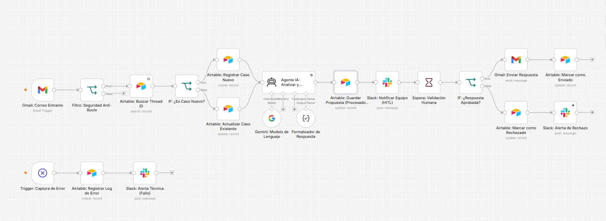

# Ecosistema de Automatización IA Resiliente con Validación HITL y Orquestación en n8n

Este proyecto consiste en un **Ecosistema Autónomo de Clasificación y Respuesta de Mensajes de Clientes (Triage de Soporte y Leads VIP)**. El sistema es reactivo, resiliente a fallas de API, utiliza un modelo LLM para la toma de decisiones cognitivas, almacena los estados de manera relacional en Airtable e incorpora validación humana en tiempo real a través de Slack (Human-in-the-Loop) antes de emitir la comunicación final vía Gmail.

---

## 🔗 Enlaces Obligatorios del Proyecto

*   **Base de Datos (Airtable - Modo Lectura):** [👉 Haz clic aquí para ver la Base de Datos](https://airtable.com/invite/l?inviteId=invhaA7f7NcVfVDYh&inviteToken=adffc24b6efe69f7008e94a5873eee0e8fd5365fc676ed7571394842201d7304&utm_medium=email&utm_source=product_team&utm_content=transactional-alerts)
*   **Video Demostrativo (3 Minutos):** [👉 Ver Video Demo del Funcionamiento](https://drive.google.com/file/d/19N2YoqT83Tesd3iY2AfXS20ime9tEzMb/view?usp=sharing)
*   **Informe Técnico Completo (PDF):** [Descargar Informe Técnico](./docs/informe_tecnico.pdf)

---

## 🛠️ Tecnologías Utilizadas

*   **Orquestador:** n8n (Flujo reactivo controlado por Webhooks y lógica condicional avanzada).
*   **Base de Datos / Memoria:** Airtable (Esquema relacional de dos tablas con tracking de estados y auditoría de errores).
*   **Motor de Inteligencia Artificial:** Google Gemini (vía API con limitación estricta de Max Tokens).
*   **Canales de Salida:** Gmail (Salida multicanal integrada con Thread ID) y Slack (Canal de control e interacción HITL).

---

## 📐 Diagrama de Arquitectura del Sistema

El flujo inicia con la recepción de un correo, valida la seguridad anti-bucle, consulta la persistencia de datos en Airtable, procesa con el Agente IA, notifica e interactúa con el operador de soporte en Slack y finalmente resuelve mediante Gmail.

*(Sugerencia: Coloca aquí el diagrama de arquitectura o la captura de tu n8n)*

---

## 🚦 Ciclo de Vida y Estados del Caso

El sistema garantiza que cada interacción con el cliente esté controlada mediante los siguientes estados en Airtable:
1.  **`Pendiente`**: El correo ingresa al sistema, es filtrado por seguridad y registrado.
2.  **`Procesado por IA`**: El agente LLM genera la propuesta de respuesta y se notifica al equipo humano en Slack. El flujo queda en pausa.
3.  **`Aprobado por Humano`**: El operador valida el correo en Slack, el flujo se reanuda, envía la respuesta a través de Gmail y cierra el caso.
4.  **`Rechazado por Humano`**: Si la propuesta es inválida, se actualiza el estado y se alerta al equipo para que responda manualmente.

---

## 🛡️ Resiliencia y Control de Errores

El flujo cuenta con un nodo global **`Error Trigger`** que se activa de forma automática si la base de datos o el motor de IA fallan. Ante una excepción:
*   Registra de manera relacional la hora del fallo, el nodo de origen y el mensaje de error en la tabla `Logs de Errores` en Airtable.
*   Envía una alerta con prioridad técnica alta al canal de soporte en Slack para la intervención rápida del administrador del sistema.

---

## 🚀 ¿Cómo importar este flujo en tu n8n?

1.  Crea un nuevo flujo de trabajo (Workflow) en blanco en tu instancia de n8n.
2.  Descarga el archivo JSON ubicado en [este enlace](./workflow/ecosistema_automatizacion_ia.json) (o buscalo en la carpeta `/workflow`).
3.  Arrastra y soltá el archivo JSON directamente dentro de tu lienzo de n8n o importalo desde el menú de opciones superior derecha (**Import from file**).
4.  Configura tus credenciales para los nodos de **Gmail**, **Airtable** y **Slack**.
5.  ¡Activa el flujo y listo!
